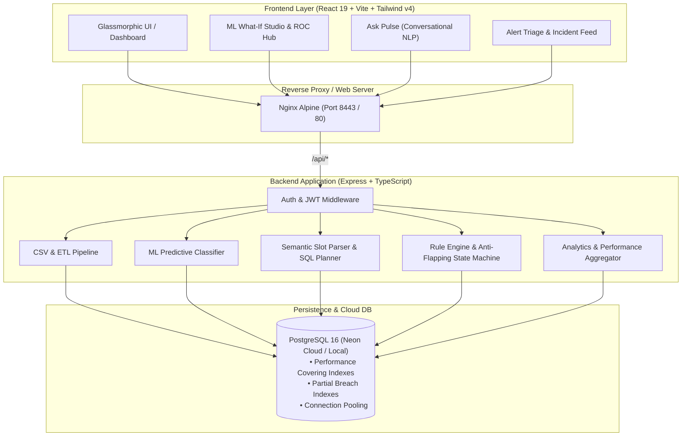

# ⚡ PeakPulse — Delivery Intelligence & Operations Analytics Platform

[](https://www.typescriptlang.org/)
[](https://react.dev/)
[](https://expressjs.com/)
[](https://www.postgresql.org/)
[](https://vitejs.dev/)
[](https://tailwindcss.com/)
[](https://www.docker.com/)
[](LICENSE)

> **PeakPulse** is a mission-critical, AI-powered Delivery Intelligence Platform engineered to eradicate Service Level Agreement (SLA) breaches, identify operational bottlenecks, and streamline last-mile logistics for hyper-growth food delivery networks.

---

## 📌 Executive Summary & Problem Statement

Fast-growing on-demand delivery platforms face severe operational friction due to **fragmented telemetry across disconnected systems**:
- **Delivery logs** sit isolated in transactional order databases.
- **Rider telemetry & assignment latencies** reside in dispatch fleets.
- **Customer complaints** are trapped in customer support ticketing tools.
- **Refund & dispute records** remain siloed in financial payment gateways.

### The Consequences:
1. **Severe SLA Violations**: Operations teams cannot identify which delivery patterns, kitchen lags, or traffic bottlenecks trigger late deliveries during lunch (12:00–14:00) and dinner (19:00–22:00) rush hours.
2. **Customer Churn & Margin Bleed**: Unresolved SLA violations directly cause customer dissatisfaction and high refund rates.
3. **Reactive Firefighting**: Dispatch managers only discover issues *after* deliveries fail and complaints are logged.

### The PeakPulse Solution:
PeakPulse integrates multi-source operational telemetry into a unified analytics engine with **sub-50ms query latency**, real-time anomaly detection, proactive machine learning risk prediction ($ROC\text{-}AUC \approx 0.992$), and natural language conversational analytics.

---

## 🌟 Core System Modules & Features

```
                                    ┌─────────────────────────────────────────┐
                                    │         PEAKPULSE UNIFIED PLATFORM      │
                                    └────────────────────┬────────────────────┘
                                                         │
         ┌───────────────────┬───────────────────────────┼───────────────────────────┬───────────────────┐
         ▼                   ▼                           ▼                           ▼                   ▼
┌─────────────────┐ ┌─────────────────┐         ┌─────────────────┐         ┌─────────────────┐ ┌─────────────────┐
│ 📊 Operations   │ │ 🤖 ML SLA       │         │ 🚨 Operational  │         │ 💬 NLP Convers. │ │ ⚡ Real-Time    │
│    Dashboard    │ │    Predictor    │         │    Alerts Hub   │         │    Analytics    │ │    Risk Engine│
│ • 24H SLA Pulse │ │ • Random Forest │         │ • 5 Anomaly Ruls│         │ • Slot Parser   │ │ • Live Fleet P(B│
│ • Zone Heatmaps │ │ • Gradient Boost│         │ • Anti-Flapping │         │ • SQL Generator │ │ • Prescriptive  │
│ • Rider Metrics │ │ • SHAP Waterfall│         │ • 1-Click RCA   │         │ • In-Chat Charts│ │   Mitigations   │
└─────────────────┘ └─────────────────┘         └─────────────────┘         └─────────────────┘ └─────────────────┘
```

### 1. 📊 Executive Operations Dashboard & Real-Time Monitoring
- **24H SLA Pulse Strip**: Interactive heat matrix visualizing zone violation intensity with hover tooltips and dynamic timeline scan lines.
- **Geographic Zone Performance**: Breach rate hotspots across all metro sectors (Downtown, Midtown, Uptown, Suburb, East, West).
- **Merchant Kitchen & Courier Diagnostics**: Pinpoints top delayed restaurants, kitchen prep latency, and courier transit velocity.
- **Complaint & Financial Refund Breakdown**: Categorizes dispute volume and financial impact by root cause.

### 2. 🤖 Machine Learning SLA Breach Predictor
- **Multi-Model Classifier Suite**:
  - **Random Forest Ensemble** ($N=25$ trees, Gini Impurity): $ROC\text{-}AUC = 0.992$, $F_1 = 0.986$.
  - **Gradient Boosted Decision Trees** ($\eta=0.1$): High sensitivity for urban congestion.
  - **L2-Regularized Logistic Regression**: Sub-millisecond inference ($<0.5\text{ms}$) with calibrated log-odds.
- **16-Dimensional Feature Engineering**: Integrates radial distance, assignment delay, kitchen prep lag, SLA buffer headroom, cyclic temporal encodings ($\sin/\cos$ hour), destination zone risk priors, courier lifetime experience, and weather multipliers.
- **Explainable AI (XAI)**: SHAP-style waterfall attributions showing exact positive and negative feature contributions.
- **Interactive What-If Prediction Studio**: Real-time parameter sliders with dynamic radial probability gauges and prescriptive 1-click mitigation dispatches.

### 3. 🚨 Real-Time Operational Alerts & Incident Triage
- **5 Anomaly Detection Trigger Rules**:
  1. `RULE_ZONE_BREACH`: Delivery zone breach rate exceeding threshold ($>20\%$).
  2. `RULE_RESTAURANT_PREP`: Kitchen preparation exceeding standard tolerance ($>18\text{ min}$).
  3. `RULE_HIGH_RISK_SURGE`: $\ge 4$ orders in a zone entering Critical Risk ($P(\text{Breach}) > 75\%$).
  4. `RULE_FLEET_SHORTAGE`: Courier deficit ($\ge 1.5\text{ orders/available rider}$).
  5. `RULE_WEATHER_HAZARD`: Severe transit velocity drag factor ($\ge 1.5\times$).
- **Anti-Flapping & Cooldown State Machine**: Enforces a 15-minute suppression window after incident resolution to prevent alarm fatigue.
- **Root Cause Analysis (RCA) Modal**: Structured triage workflow capturing analyst attribution and resolution notes.

### 4. 💬 NLP & Conversational Analytics Engine ("Ask Pulse")
- **Semantic Entity & Slot Extraction**: Understands complex operational queries (e.g., *"Which restaurants had the most dinner-time SLA breaches in North Zone?"*).
- **Temporal & Meal-Window Normalizer**: Maps phrases like *"dinner rush"* or *"yesterday lunch"* into concrete hourly ranges (`19:00 - 22:00`).
- **Dynamic Analytical Query Planner & SQL Generation**: Compiles semantic intents into transparent PostgreSQL analytical queries.
- **Multi-Modal Visual Responses**: Returns conversational summaries, dynamic in-chat bar/donut charts, tabular rankings, and follow-up drill-down chips.
- **Voice / Speech-to-Text Input**: Integrated Web Speech API for hands-free operational querying.

### 5. 📥 Multi-Source CSV Ingestion & ETL Data Pipeline
- Automated validation, schema checking, and relational ingestion for 4 operational feeds:
  1. `delivery_logs.csv`
  2. `rider_assignments.csv`
  3. `complaints.csv`
  4. `refunds.csv`
- Error isolation and batch transactional database insertion.

### 6. 🔒 Enterprise Security & User Profile Management
- **JWT Authentication**: Short-lived access tokens with secure refresh token rotation stored in PostgreSQL.
- **Profile Module**: Authenticated endpoints (`/api/users/me`, `/api/users/change-password`, soft deletion).
- **Security Hardening**: Helmet security headers, strict CORS, express-validator input sanitization, and parameterized SQL queries to prevent injection.

---

## 🏗️ System Architecture



---

## 🛠️ Technology Stack

| Layer | Technologies |
| :--- | :--- |
| **Frontend** | React 19, TypeScript 5.7, Vite 8, Tailwind CSS v4, Glassmorphism Design System, Lucide Icons |
| **Backend** | Node.js 20, Express.js 4.18, TypeScript 5.3, tsx, Prisma ORM 7, pg driver (PostgreSQL Pool) |
| **Security & Auth** | JSON Web Tokens (`jsonwebtoken`), `bcryptjs`, `helmet`, `cors`, `express-validator` |
| **Database & Cache** | PostgreSQL 16 (Compatible with Neon Cloud SSL), Composite & Partial Indexing |
| **ML & Analytics** | Ensemble Random Forest, Gradient Boosting, Regularized Logistic Regression, SHAP Attribution, Confusion Matrix / ROC-AUC Math Suite |
| **NLP Engine** | Rule-Based Semantic Tokenizer, Slot Filling, SQL Synthesizer, Web Speech Recognition |
| **DevOps & Containers**| Docker, Multi-Stage Dockerfiles (Alpine), Docker Compose, Nginx Reverse Proxy |

---

## 🗄️ Database Schema & Performance Indexing

PeakPulse is backed by a highly optimized PostgreSQL relational schema:

```
┌──────────────┐       ┌─────────────────┐       ┌────────────────┐
│  customers   │◄──┐   │   restaurants   │◄──┐   │     riders     │
└──────────────┘   │   └─────────────────┘   │   └────────────────┘
                   │                         │           ▲
                   │   ┌─────────────────┐   │           │
                   └───┤   deliveries    ├───┘           │
                       └────────┬────────┘               │
                                │                        │
         ┌──────────────────────┼──────────────────────┐ │
         ▼                      ▼                      ▼ └──────────────┐
┌─────────────────┐    ┌─────────────────┐    ┌──────────────────┐      │
│   complaints    │    │     refunds     │    │rider_assignments ├──────┘
└─────────────────┘    └─────────────────┘    └──────────────────┘
```

### Production High-Performance Indexes
To guarantee sub-50ms analytical response times:
- `idx_deliveries_zone_order_time_sla`: Multi-zone timeline filtering.
- `idx_deliveries_breached_only`: **Partial index** on breached orders (`WHERE is_sla_violated = true`), skipping 85%+ on-time rows for instant hotspot retrieval.
- `idx_deliveries_zone_analytics`: **Covering index** satisfying aggregations without touching heap tables.
- `idx_users_email_active`: Sub-millisecond JWT authentication lookups.

---

## 🔌 API Reference

All protected endpoints require `Authorization: Bearer <ACCESS_TOKEN>`.

### 1. Authentication & Users
| Method | Endpoint | Description | Auth |
| :--- | :--- | :--- | :--- |
| `GET` | `/health` | Server and PostgreSQL health check | Public |
| `POST` | `/api/auth/register` | Register a new analyst/admin user | Public |
| `POST` | `/api/auth/login` | Authenticate and obtain JWT + refresh token | Public |
| `POST` | `/api/auth/refresh` | Exchange refresh token for new access token | Public |
| `POST` | `/api/auth/logout` | Invalidate active refresh token | Bearer |
| `GET` | `/api/users/me` | Fetch active user profile | Bearer |
| `PUT` | `/api/users/me` | Update allowed profile fields | Bearer |
| `PUT` | `/api/users/change-password` | Change password with current password verification | Bearer |
| `DELETE`| `/api/users/me` | Soft delete account | Bearer |

### 2. Analytics & Operations
| Method | Endpoint | Description | Auth |
| :--- | :--- | :--- | :--- |
| `GET` | `/api/analytics/stats` | High-level summary KPI metrics | Bearer |
| `GET` | `/api/analytics/sla-violations` | SLA violation breakdown by zone and time | Bearer |
| `GET` | `/api/analytics/peak-hours` | Hourly volume and delay patterns | Bearer |
| `GET` | `/api/analytics/complaints` | Customer complaint categorization | Bearer |
| `GET` | `/api/analytics/refunds` | Refund cost analysis by reason | Bearer |
| `GET` | `/api/analytics/insights` | Automated operational anomaly insights | Bearer |

### 3. Machine Learning SLA Predictor
| Method | Endpoint | Description | Auth |
| :--- | :--- | :--- | :--- |
| `POST` | `/api/ml/predict` | Single delivery breach risk with SHAP attribution | Bearer |
| `POST` | `/api/ml/batch-predict` | Batch classification for multiple active orders | Bearer |
| `POST` | `/api/ml/train` | Retrain and tune ensemble hyperparameters | Bearer |
| `GET` | `/api/ml/metrics` | ROC-AUC, $F_1$, precision, recall & confusion matrix | Bearer |
| `GET` | `/api/ml/roc-curve` | Coordinate array $(\text{FPR}, \text{TPR}, \theta)$ for ROC plot | Bearer |
| `GET` | `/api/ml/feature-importance`| Ranked Gini feature importance coefficients | Bearer |
| `GET` | `/api/ml/models` | Multi-model comparative benchmark table | Bearer |

### 4. Operational Alerts & Incident Triage
| Method | Endpoint | Description | Auth |
| :--- | :--- | :--- | :--- |
| `GET` | `/api/alerts` | Paginated alert feed with severity/zone filters | Bearer |
| `GET` | `/api/alerts/active` | Live unacknowledged alarm feed | Bearer |
| `GET` | `/api/alerts/summary` | Triage KPIs (MTTA, MTTR, critical counts) | Bearer |
| `PATCH`| `/api/alerts/:id/acknowledge`| Acknowledge active incident | Bearer |
| `PATCH`| `/api/alerts/:id/resolve` | Resolve incident with structured RCA notes | Bearer |
| `GET` | `/api/alerts/rules` | List anomaly trigger thresholds | Bearer |
| `PUT` | `/api/alerts/rules/:id` | Update threshold or cooldown window | Bearer |
| `POST` | `/api/alerts/simulate` | Trigger operational incident drill | Bearer |

### 5. Conversational Analytics (NLP)
| Method | Endpoint | Description | Auth |
| :--- | :--- | :--- | :--- |
| `POST` | `/api/nlp/query` | Execute natural language analytical query | Bearer |
| `GET` | `/api/nlp/suggestions` | Fetch curated starter questions library | Bearer |
| `GET` | `/api/nlp/schema` | Entity, dimension, and metric catalog | Bearer |

### 6. CSV Data Ingestion & Live Demo Seeder
| Method | Endpoint | Description | Auth |
| :--- | :--- | :--- | :--- |
| `POST` | `/api/import/upload` | Upload & validate operational CSV files | Bearer |
| `GET` | `/api/import/info` | CSV format specifications & required headers | Bearer |
| `POST` | `/api/demo/seed` | Seed/reset 520+ order demonstration dataset | Bearer |
| `GET` | `/api/demo/status` | Dataset record counts & system status | Bearer |

---

## 🚀 Quick Start Guide

### Prerequisites
- **Node.js 20+** (LTS recommended)
- **PostgreSQL 14+** (or use Neon Cloud / Docker Compose)
- **npm** or **pnpm**

---

### Option A: Running with Docker Compose (Recommended for Production)

Run the complete multi-container stack (PostgreSQL, Express API, Nginx React SPA) with a single command:

```bash
# Clone the repository
git clone https://github.com/kalviumcommunity/PeakPulse.git
cd PeakPulse

# Build and start all services in detached mode
docker compose up --build -d

# Verify running containers
docker compose ps
```

- **Frontend Application**: `http://localhost:8443` (or `http://localhost:80`)
- **Backend API**: `http://localhost:5000`
- **Health Check**: `http://localhost:5000/health`

---

### Option B: Local Development Setup

#### 1. Backend Setup

```bash
# Navigate to backend directory
cd backend

# Install dependencies
npm install

# Create environment configuration
cp .env.example .env
```

Configure your `.env` file:
```env
PORT=5000
NODE_ENV=development
DB_HOST=localhost
DB_PORT=5432
DB_NAME=peakpulse
DB_USER=postgres
DB_PASSWORD=your_password
JWT_SECRET=your_super_secret_jwt_key_at_least_32_characters
JWT_EXPIRES_IN=7d
FRONTEND_URL=http://localhost:8443
```

Execute database migrations and seed sample records:
```bash
# Run core schema migration
npm run migrate

# Run profile fields migration
npm run migrate:profile

# Apply performance indexes
npm run migrate:indexes

# Seed initial demonstration dataset (Admin + 520+ deliveries)
npm run seed
```

Start the backend development server:
```bash
npm run dev
# Server running at http://localhost:5000
```

#### 2. Frontend Setup

In a separate terminal window:
```bash
# Navigate to frontend directory
cd frontend

# Install dependencies
npm install

# Start Vite development server
npm run dev
# Frontend running at http://localhost:8443
```

---

## 🧪 Testing & Quality Assurance

PeakPulse includes a comprehensive test harness covering unit, integration, ML accuracy, and API endpoints:

```bash
cd backend

# Execute master test harness (100/100 tests)
npm run test:all

# Run integration API tests specifically
npm run test:integration

# Verify TypeScript compilation across the entire codebase
npm run build
```

---

## 📁 Repository Structure

```
PeakPulse/
├── .github/                      # CI/CD workflows and PR templates
├── backend/                      # Express + TypeScript Backend API
│   ├── src/
│   │   ├── config/               # Database & environment configurations
│   │   ├── controllers/          # HTTP request handlers (Auth, ML, Alerts, NLP, Analytics)
│   │   ├── database/             # Schema, migrations, performance indexes, and seeders
│   │   │   ├── migrations/       # Schema updates & indexing scripts
│   │   │   ├── connection.ts     # PostgreSQL connection pool
│   │   │   ├── schema.sql        # Core relational database schema
│   │   │   └── seed.ts           # Demo dataset seeder
│   │   ├── middleware/           # JWT auth, validation, error handler, rate limiter
│   │   ├── routes/               # API route definitions
│   │   ├── services/             # Core business logic:
│   │   │   ├── ml-predictor.service.ts   # ML ensemble models & SHAP engine
│   │   │   ├── alerts.service.ts         # Anomaly detection & anti-flapping engine
│   │   │   ├── nlp-analytics.service.ts  # Semantic query parser & SQL generator
│   │   │   ├── analytics.service.ts      # Statistical aggregations
│   │   │   ├── risk-scoring.service.ts   # Real-time risk evaluator
│   │   │   └── user.service.ts           # User profile management
│   │   ├── tests/                # Automated unit & integration test harness
│   │   ├── types/                # TypeScript interfaces & DTO schemas
│   │   ├── utils/                # Password hashing, JWT signing, math helpers
│   │   └── server.ts             # Express application entrypoint
│   ├── Dockerfile                # Multi-stage Node 20 Alpine builder
│   ├── package.json              # Backend dependencies and scripts
│   └── tsconfig.json             # TypeScript configuration
├── frontend/                     # React 19 + Vite + Tailwind v4 Single Page Application
│   ├── src/
│   │   ├── components/           # Reusable UI elements (PulseStrip, DemoBanner, Skeleton, Sidebar)
│   │   ├── pages/                # Main application views:
│   │   │   ├── Dashboard.tsx               # Executive operations overview
│   │   │   ├── MLPredictor.tsx             # ROC-AUC hub & What-If Studio
│   │   │   ├── OperationalAlerts.tsx       # Live alert feed & RCA manager
│   │   │   ├── ConversationalAnalytics.tsx # Ask Pulse natural language chat
│   │   │   ├── RiskMonitor.tsx             # Active fleet real-time risk feed
│   │   │   ├── OperationsDashboard.tsx     # Deep-dive operational telemetry
│   │   │   ├── Zones.tsx                   # Metro sector performance
│   │   │   ├── Incidents.tsx               # Historic incident logs & audit
│   │   │   ├── Reports.tsx                 # Exportable executive summaries
│   │   │   ├── SignIn.tsx                  # User authentication
│   │   │   └── Landing.tsx                 # Platform presentation landing page
│   │   ├── App.tsx               # Root component & page router
│   │   ├── main.tsx              # React mounting entrypoint
│   │   └── index.css             # Design tokens & Tailwind v4 imports
│   ├── Dockerfile                # Multi-stage Nginx Alpine SPA container
│   ├── nginx.conf                # Production Nginx reverse proxy configuration
│   ├── package.json              # Frontend dependencies and scripts
│   └── vite.config.ts            # Vite 8 build configuration
├── docker-compose.yml            # Multi-container production orchestration
├── IMPLEMENTATION_REPORT.md      # Detailed architecture & verification report
├── SETUP.md                      # Detailed environment setup documentation
└── README.md                     # Master project documentation
```

---

## 👥 Authors & Academic Attribution

- **Project**: PeakPulse Delivery Intelligence Platform
- **Curriculum**: Semester 5 - Sprint 1
- **Institution**: Chitkara University
- **Squad**: 84 | **Team**: 03

---

## 📄 License

This project is licensed under the **MIT License** — see the [LICENSE](LICENSE) file for details.
